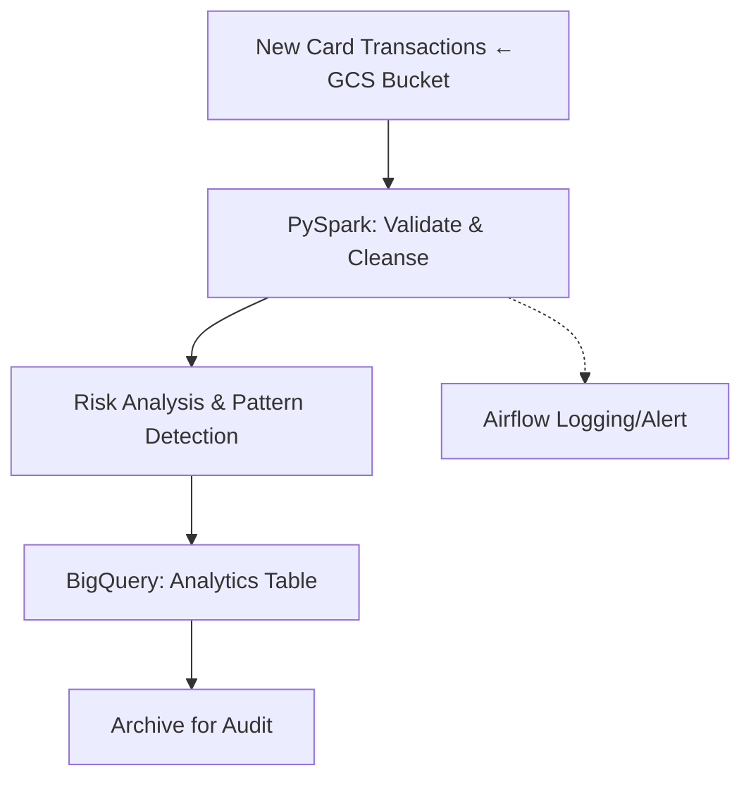

Here is a **ready-to-copy-paste README.md** for your **Credit Card Fraud Risk Analytics Pipeline** that’s designed to stand out from your retail ETL project while staying recruiter-friendly, business-focused, and technical:

***

# Credit Card Fraud Risk Analytics Pipeline

[![Python](https://img.shields.io/badge/Python-3.11-blue?logo=python
[![PySpark](https://img.shields.io/badge/PySpark-3.5-orange?logo=apache-s(https://spark.apache.orghttps://img.shields.io/badge/GCP-Data%20Pipeline-red?logo=googlecloud&logoColor=white(https://cloud.google.comhttps://img.shields.io/badge/Airflow-2.7-blue?logo=apache-air(https://airflow.apache.orghttps://img.shields.io/github/actions/workflow/status/Rehaman24/Credit-card-fraud-analytics(https://github.com/Rehaman24/Credit-card-fraud-analytics Executive Overview

This project delivers an automated analytics pipeline to identify credit card fraud risk at scale. Built for **finance and risk analytics teams**, it systematically ingests, validates, scores, and delivers actionable results—helping organizations rapidly flag and respond to suspicious patterns with speed, integrity, and full traceability.

***

## 💼 Business & Technical Value

| Capability               | Benefit                                              |
|--------------------------|-----------------------------------------------------|
| Automated risk scoring   | Accelerates detection of suspicious transactions    |
| Bulletproof validation   | Guarantees high data quality and audit compliance   |
| Scalable architecture    | Handles daily, high-volume transaction loads        |
| End-to-end transparency  | Full logging and traceability for every event       |

***

## 🚦 Key Differentiators

- Not a generic ETL—**purpose-built for security and compliance analytics**
- Modular validation, alerting, and scoring logic for robust fraud operations
- Strong focus on **audit trails, anomaly handling, and governance**
- Data products are immediately queryable and actionable in BigQuery

***

## 🌐 Architecture Diagram

***

## 🔄 Workflow Summary

1. **Trigger:** Pipeline listens for new transactional data on cloud storage (GCS)
2. **Validation:** Cleanses, type-checks, and deduplicates in PySpark
3. **Risk Analysis:** Applies rule-based and statistical scoring
4. **Publishing:** Loads enriched results to BigQuery for BI and downstream action
5. **Archiving & Alerts:** Maintains provable audit trail and triggers alerts on anomalies

***

## 🛠 Technology Stack

- **Cloud Platform:** Google Cloud Platform (GCP)
- **Data Storage:** Google Cloud Storage, BigQuery
- **Orchestration:** Airflow (Cloud Composer)
- **Processing Engine:** PySpark
- **Testing & CI/CD:** PyTest, GitHub Actions
- **Security:** GCP IAM, principle of least privilege

***

## ✅ Sample Use Case

- **Scenario:** New batch of credit card transactions (e.g. 100K/day) lands in GCS  
- **Pipeline outcome:** Within minutes, high-risk transactions are scored, flagged, and loaded for fraud analysts—backed by full data lineage and no manual touchpoints

***

## 💡 Professional Skills Demonstrated

- Built cloud-native pipelines for fraud/risk
- Enabled analytics teams with trustworthy, business-ready data
- Automated detection and response cycles for operational risk teams
- Delivered production-grade code with monitoring, testing, and CI/CD

***

## ✨ What's Unique vs. Typical Retail ETL

- Controls, logs, and tracks every anomaly for compliance—not just transformations
- **Validation-first** philosophy: no “garbage in, garbage out”
- Designed as an *analytics product*, not just a backend ETL routine

***

## 📫 Contact

**Author:** Rehman Ali  
**LinkedIn:** [linkedin.com/in/rehmanali24](https://linkedin.com/in/rehmanali24)

*Feedback, reviews, and connections welcome.*

***

**Last updated: Nov 2025**

---
